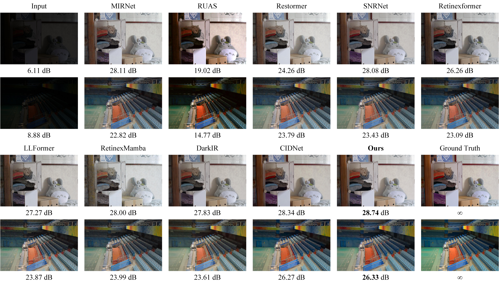
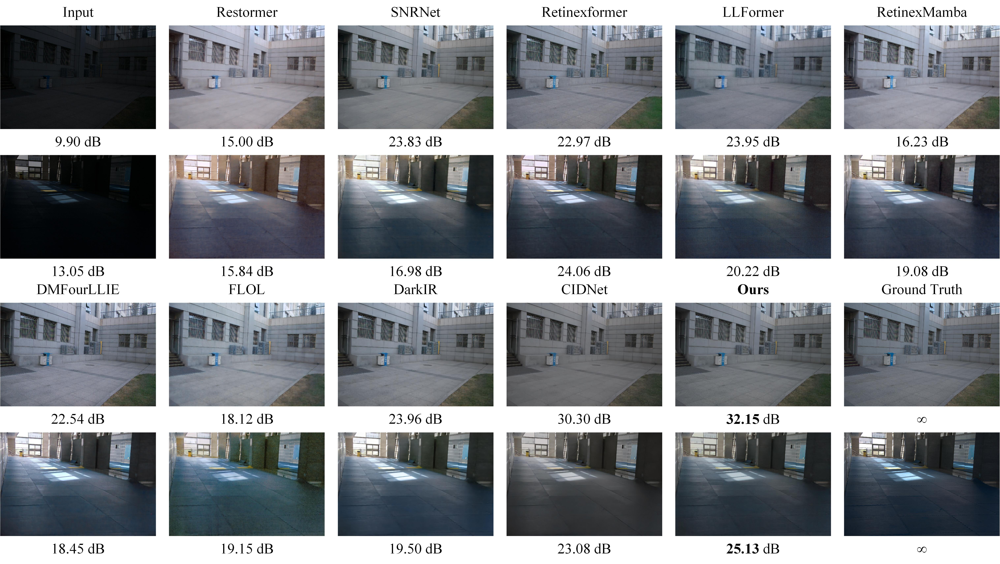
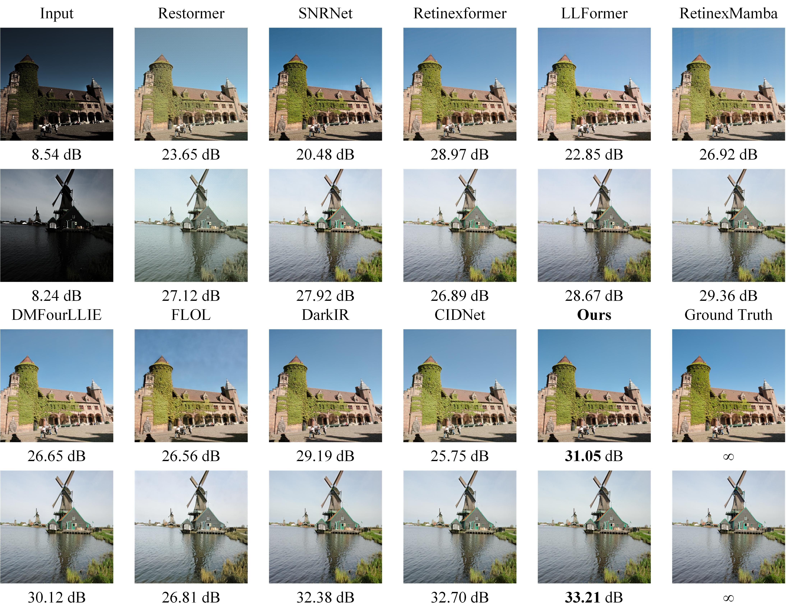
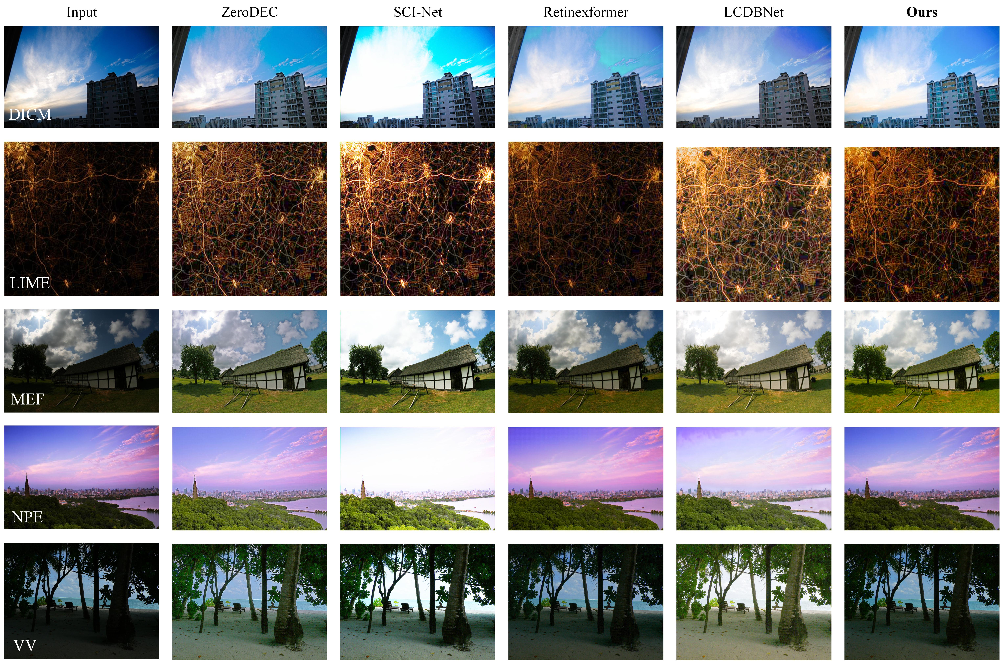

# LIIANet
LIIA-Net: A Lightweight Illumination Iterative Adjustment Network for Low-Light Image Enhancement

---------------------

- Our code will be sorted and uploaded

## Abstract
We will publish it after receiving our paper
## Result

- Our results on the reference dataset can be downloaded from [Baidu Cloud](https://pan.baidu.com/s/144uTxafOAYxopjwtje8IBA?pwd=LIIA)(code:LIIA) or[ Google Cloud](https://drive.google.com/drive/folders/15Gllr-AcTCzFzx_sh4pX7S3Hvt7Fx9Ah?usp=drive_link).

- Our results on the no-reference dataset can be downloaded from [Baidu Cloud](https://pan.baidu.com/s/18yZN33XDsfZ-iELjN2n9Jw?pwd=LIIA)(code:LIIA) or [Google Cloud](https://drive.google.com/drive/folders/11_74-_Mz5hhey8CFOK4v_2rETqAXN02V?usp=drive_link).

<details close>
<summary><b>Performance on LOL datasets</b></summary>


</details>

<details close>
<summary><b>Visual results on the LOL dataset</b></summary>

The LOL-v1 dataset is listed from top to bottom; LOL-v2 real dataset; Images in the LOL-v2 syn dataset






</details>

<details close>
<summary><b>Visual performance on LIME, DICM, MEF, NPE, and VV datasets</b></summary>



</details>

## 1. Create Environment

- Make Conda Environment

```shell
conda create -n LIIA python=3.10 -y
conda activate LIIA
conda install torch 2.1.2+cu121 -c pytorch
pip install -r requirements.txt

```

- Install mamba and vssm

```shell
cd causal-conv1d
pip install . --no-cache-dir --verbose
cd ./../mamba
pip install . --no-cache-dir --verbose
cd VMamba
cd kernels/selective_scan && pip install .
```

## 2. Prepare Dataset

Download the following datasets:

LOL-v1 [Baidu Disk](https://pan.baidu.com/s/1ZAC9TWR-YeuLIkWs3L7z4g?pwd=cyh2) (code: `cyh2`), [Google Drive](https://drive.google.com/file/d/1L-kqSQyrmMueBh_ziWoPFhfsAh50h20H/view?usp=sharing)

LOL-v2 [Baidu Disk](https://pan.baidu.com/s/1X4HykuVL_1WyB3LWJJhBQg?pwd=cyh2) (code: `cyh2`), [Google Drive](https://drive.google.com/file/d/1Ou9EljYZW8o5dbDCf9R34FS8Pd8kEp2U/view?usp=sharing)

<details close>
<summary><b> Then organize these datasets as follows: </b></summary>

```
    |--data   
    |    |--LOLv1
    |    |    |--Train
    |    |    |    |--input
    |    |    |    |    |--100.png
    |    |    |    |    |--101.png
    |    |    |    |     ...
    |    |    |    |--target
    |    |    |    |    |--100.png
    |    |    |    |    |--101.png
    |    |    |    |     ...
    |    |    |--Test
    |    |    |    |--input
    |    |    |    |    |--111.png
    |    |    |    |    |--146.png
    |    |    |    |     ...
    |    |    |    |--target
    |    |    |    |    |--111.png
    |    |    |    |    |--146.png
    |    |    |    |     ...
    |    |--LOLv2
    |    |    |--Real_captured
    |    |    |    |--Train
    |    |    |    |    |--Low
    |    |    |    |    |    |--00001.png
    |    |    |    |    |    |--00002.png
    |    |    |    |    |     ...
    |    |    |    |    |--Normal
    |    |    |    |    |    |--00001.png
    |    |    |    |    |    |--00002.png
    |    |    |    |    |     ...
    |    |    |    |--Test
    |    |    |    |    |--Low
    |    |    |    |    |    |--00690.png
    |    |    |    |    |    |--00691.png
    |    |    |    |    |     ...
    |    |    |    |    |--Normal
    |    |    |    |    |    |--00690.png
    |    |    |    |    |    |--00691.png
    |    |    |    |    |     ...
    |    |    |--Synthetic
    |    |    |    |--Train
    |    |    |    |    |--Low
    |    |    |    |    |   |--r000da54ft.png
    |    |    |    |    |   |--r02e1abe2t.png
    |    |    |    |    |    ...
    |    |    |    |    |--Normal
    |    |    |    |    |   |--r000da54ft.png
    |    |    |    |    |   |--r02e1abe2t.png
    |    |    |    |    |    ...
    |    |    |    |--Test
    |    |    |    |    |--Low
    |    |    |    |    |   |--r00816405t.png
    |    |    |    |    |   |--r02189767t.png
    |    |    |    |    |    ...
    |    |    |    |    |--Normal
    |    |    |    |    |   |--r00816405t.png
    |    |    |    |    |   |--r02189767t.png
    |    |    |    |    |    ...

```

</details>


We also provide download links for LIME, NPE, MEF, DICM, and VV datasets that have no ground truth:

[Baidu Disk](https://pan.baidu.com/s/1IPHseGVdWgUMeJMWCE6Flg?pwd=yIPR) (code: `yIPR`)
 or [Google Drive](https://drive.google.com/drive/folders/141Do9QmDPY3aqvZ2gG8LUanMu20W1aeR?usp=drive_link)

## 3. Testing

Obtain our weights from the link below and place them in the pth folder

 [Baidu Cloud](https://pan.baidu.com/s/1wLXFzNvQwF-hfRjSHqyYCQ?pwd=LIIA)(code:LIIA) or[ Google Cloud](https://drive.google.com/drive/folders/1uM_xNMZJAjUHM0WOQvHuI49a7VGSs42w?usp=drive_link).


```shell
# activate the environment
conda activate LIIA-Net

# LOL-v1
python eval.py --lol --test --weight_path ./pth/v1.pth

# LOL-v2-real
python eval.py --lol_v2_real --test --weight_path ./pth/v2-re.pth

# LOL-v2-synthetic
python eval.py --lol_v2_syn --test --weight_path ./pth/v2-syn.pth
```
## 4. Measure

Then measure the indicators of the results obtained

```shell

python measure.py --lol --use_GT_mean

python measure.py --lol_v2_real

python measure.py --lol_v2_syn

```


## 5. Acknowledgments

We thank the following article and the authors for their open-source codes.

```shell
@inproceedings{37.yan2025hvi,
  title={Hvi: A new color space for low-light image enhancement},
  author={Yan, Qingsen and Feng, Yixu and Zhang, Cheng and Pang, Guansong and Shi, Kangbiao and Wu, Peng and Dong, Wei and Sun, Jinqiu and Zhang, Yanning},
  booktitle={Proceedings of the Computer Vision and Pattern Recognition Conference},
  pages={5678--5687},
  year={2025}
}
```
